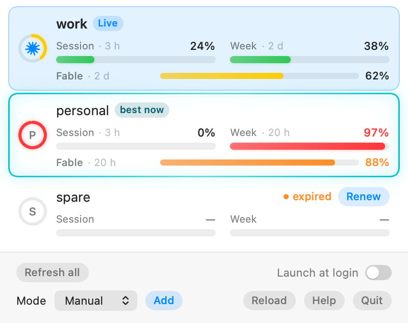

# Claude Account Switcher

A macOS menu bar app for people with more than one Claude Code login. It shows every
account's quota and switches the live login in one click.

<p align="center">
  <picture>
    <source media="(prefers-color-scheme: dark)" srcset="docs/panel-dark.png">
    
  </picture>
</p>

## Features

- **All quotas in one place** — session, weekly and per-model usage for every account, each
  with its own reset time. Numbers match Claude Code's `/usage`.
- **One-click switching** — click an account to make it the live login, with Undo.
- **Sign in from the app** — add or repair an account through the browser. No terminal.
- **Tokens stay fresh** — idle accounts are renewed in the background so their quota stays readable.
- **Optional automatic switching** — *Failover* leaves an account that has run out; *Balance*
  spreads usage so no weekly window resets unused. Off by default.

## Install

```sh
brew tap armandrt/tap
brew trust armandrt/tap    # Homebrew 7 and later
brew install --cask claude-account-switcher
```

Or download the `.dmg` from the [latest release](https://github.com/armandrt/claude-account-switcher/releases/latest)
and drag the app into Applications. The app is not notarised, so a direct download needs one
extra step before its first launch (Homebrew does this for you):

```sh
xattr -dr com.apple.quarantine /Applications/ClaudeAccountSwitcher.app
```

Requires macOS 14 or later.

## Usage

Click the mark in the menu bar to open the panel. The row with an aura is the account to use
now: still usable, and the first whose week resets. Click an account to switch to it; **More**
on a row renews, renames or removes it; drag rows to reorder. **Add account** signs in through
the browser. New `claude` sessions use the new login straight away.

## Building from source

Needs a Swift 6 toolchain (Xcode or the Command Line Tools).

```sh
scripts/make-signing-identity.sh   # once
scripts/make-app.sh --install      # builds and copies the app into /Applications
scripts/test.sh
```

Use the scripts rather than plain `swift build` / `swift test`. How the app works, and why, is
in [docs/DESIGN.md](docs/DESIGN.md).

## Caveats

- The quota endpoint is the undocumented one behind Claude Code's `/usage`; it can change
  without notice.
- Sign-in and token renewal reuse Claude Code's public OAuth client. Only account metadata
  goes through it, never inference.
- Automatic switching between accounts may conflict with Anthropic's terms of service. It is
  off by default and the choice is yours.
- Not affiliated with Anthropic. "Claude" is a trademark of Anthropic, PBC.

## License

[MIT](LICENSE)
